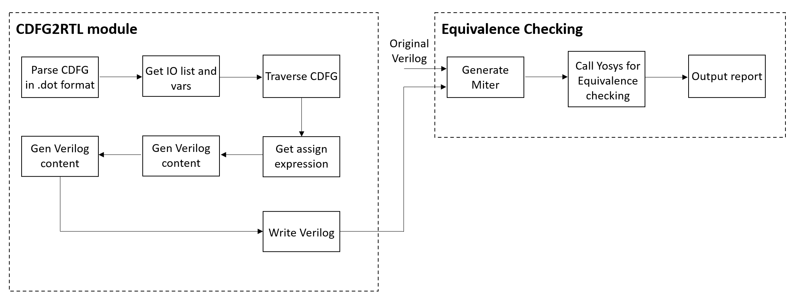

<div style="text-align: center;">
    <h1>CDFG2RTL: The reverse project of RTL2CDFG</h1>
</div>

<div style="text-align: right;">
    <div style="display: inline-block; text-align: left;">
        <span>Author: Yunhao Zhou</span></br>
        <span>Date: 2024-09-13</span>
    </div>
</div>

## 1. Introduction
This project is a reverse project of RTL2CDFG. It can transform the CDFG generated from RTL back to RTL. And then it can run equivalence checking between the original RTL and the RTL transformed from CDFG.


## 2. Usage
```bash
bash run.sh
```